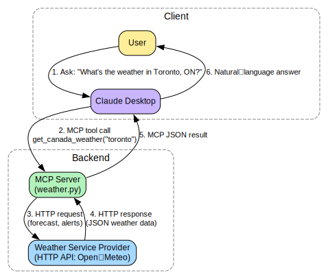

# 🌤️ Canadian Weather MCP Server

<p align="center">
  
</p>


A Model Context Protocol (MCP) server that provides real-time Canadian weather forecasts and Environment Canada alerts — built with Python and [uv](https://docs.astral.sh/uv/), designed to integrate with Claude Desktop.

---

## 🗺️ Supported Cities

| City | Province |
|------|----------|
| Hamilton | Ontario |
| Toronto | Ontario |
| Ottawa | Ontario |
| Québec City | Quebec |
| Montréal | Quebec |
| Winnipeg | Manitoba |
| Calgary | Alberta |
| Edmonton | Alberta |
| Vancouver | British Columbia |
| Halifax | Nova Scotia |

---

## 📋 Prerequisites

Before you begin, make sure you have the following installed on your Windows machine:

| Tool | Version | Download |
|------|---------|----------|
| Python | 3.13+ | https://www.python.org/downloads/ |
| `uv` (package manager) | Latest | https://docs.astral.sh/uv/getting-started/installation/ |
| Claude Desktop | Latest | https://claude.ai/download |

> **⚠️ Important:** During Python installation, check **"Add Python to PATH"** before clicking Install.

---

## 🚀 Installation & Setup

### Step 1 — Clone the Repository

Open **PowerShell** and run:

```powershell
git clone https://github.com/tridibbanik17/Canadian-Weather-MCP-Server.git
cd Canadian-Weather-MCP-Server
```

### Step 2 — Install `uv` (if not already installed)

`uv` is a fast, all-in-one Python package and project manager (replaces `pip`, `venv`, and `pyenv`).

```powershell
powershell -ExecutionPolicy ByPass -c "irm https://astral.sh/uv/install.ps1 | iex"
```

Close and reopen PowerShell after installation, then verify:

```powershell
uv --version
```

### Step 3 — Create the Virtual Environment

```powershell
uv venv
```

This creates a `.venv` folder in your project directory.

### Step 4 — Activate the Virtual Environment

```powershell
.venv\Scripts\Activate.ps1
```

> **❌ If you get an error like** `cannot be loaded because running scripts is disabled`:
>
> Run this command first, then try again:
> ```powershell
> Set-ExecutionPolicy -ExecutionPolicy RemoteSigned -Scope CurrentUser
> ```

You should now see `(.venv)` at the beginning of your terminal prompt.

### Step 5 — Install Dependencies

```powershell
uv sync
```

This installs all packages from `pyproject.toml` and `uv.lock` into your virtual environment.

---

## ⚙️ Configure Claude Desktop

You need to tell Claude Desktop where to find your MCP server.

### Step 1 — Find the Claude Desktop config file

In PowerShell, open the config file with Notepad:

```powershell
notepad "$env:APPDATA\Claude\claude_desktop_config.json"
```

> If the file doesn't exist yet, open Claude Desktop once, close it, and try again.

### Step 2 — Add your MCP server

Paste the following into the config file (replace the path with your actual project path):

```json
{
  "mcpServers": {
    "weather": {
      "command": "uv",
      "args": [
        "run",
        "--with",
        "mcp[cli]",
        "mcp",
        "run",
        "C:\\Users\\OWNER\\Downloads\\Canadian-Weather-MCP-Server\\weather.py"
      ]
    }
  }
}
```

> **💡 How to find your full path:** In PowerShell, navigate to your project folder and run `pwd`. Copy the output and replace each `\` with `\\` in the JSON.

### Step 3 — Fully Quit Claude and Restart

This step is critical. Simply closing the Claude Desktop window is not enough — Claude must be completely stopped for the new MCP configuration to load.

**1. Log out of Claude Online** (claude.ai) in your browser.

**2. Force quit Claude Desktop** via PowerShell:

```powershell
Stop-Process -Name "claude" -Force -ErrorAction SilentlyContinue
```

**3. Reopen Claude Desktop.**

You should now see a 🔨 hammer icon in the chat input — this confirms your MCP server is connected.

> **⚠️ Why this matters:** If Claude Desktop is still running in the background (even minimized or in the system tray), it won't pick up changes to `claude_desktop_config.json`. Force-quitting via PowerShell ensures all Claude processes are fully terminated before restarting.

---

## 🧪 Testing the Server Manually

You can test the MCP server directly in PowerShell without Claude Desktop:

```powershell
# Make sure your virtual environment is active first
.venv\Scripts\Activate.ps1

# Run the server
uv run mcp run weather.py
```

If it starts without errors, the server is working correctly. Press `Ctrl+C` to stop it.

---

## 🗂️ Project Structure

```
Canadian-Weather-MCP-Server/
├── .venv/               # Virtual environment (NOT committed to Git)
├── .gitignore           # Git ignore rules
├── .python-version      # Pinned Python version (3.13)
├── main.py              # Entry point
├── pyproject.toml       # Project metadata and dependencies
├── uv.lock              # Locked dependency versions
├── weather.py           # MCP server implementation
└── README.md            # This file
```

---

## 🛠️ Common Issues & Fixes

### ❌ `uv` is not recognized after installation
Close and reopen PowerShell completely. If still not working, restart your computer.

---

### ❌ `.venv\Scripts\Activate.ps1` fails with a script execution error
Run the following in PowerShell as your current user (no admin needed):
```powershell
Set-ExecutionPolicy -ExecutionPolicy RemoteSigned -Scope CurrentUser
```
Then try activating again.

---

### ❌ Claude Desktop doesn't show the hammer 🔨 icon after configuration
The most reliable fix is to fully terminate all Claude processes and restart:

```powershell
Stop-Process -Name "claude" -Force -ErrorAction SilentlyContinue
```

Then also:
- Log out of Claude Online (claude.ai) in your browser before reopening Claude Desktop.
- Double-check the path in `claude_desktop_config.json` is correct and uses `\\` (double backslashes).
- Make sure there are no trailing commas or syntax errors in the JSON file.
- Check Claude Desktop logs at: `%APPDATA%\Claude\logs\`

---

### ❌ `mcp` command not found when running manually
Make sure your virtual environment is activated (you should see `(.venv)` in your prompt). If the `mcp` package is missing, run:
```powershell
uv add "mcp[cli]"
```

---

### ❌ `uv sync` fails or packages won't install
Try clearing the cache and syncing again:
```powershell
uv cache clean
uv sync
```

---

## 📦 Dependencies

Dependencies are managed by `uv` and defined in `pyproject.toml`.

| Package | Purpose |
|---------|---------|
| `httpx` | HTTP client for fetching weather data |
| `mcp[cli]` | Model Context Protocol framework |

To add a new package:
```powershell
uv add package-name
```

To remove a package:
```powershell
uv remove package-name
```

---

## 📄 License

MIT License — feel free to use and modify this project.
